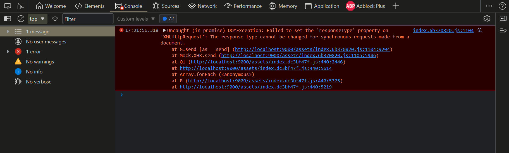
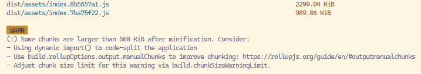

# 常见问题解答

## 1. 前言

> Tips:
> 列举了一些常见的问题。
>
> 	有问题可以先来这里寻找，
>		如果没有可以在 issue 里提。

---

遇到问题， 可以先从以下几种方式查找解决方案

- 尝试在你准备提问论坛的中搜索答案 ( CSDN | GitHub | StackoverFlow )
- 尝试搜索互联网以找到答案 ( Baidu | Google | newBing)
- 尝试阅读“常见问题文档”（FAQ）以找到答案 ( 链接 )
- 尝试自己检查或试验以找到答案 ( Codepen 或者本地搭建项目以进行尝试 )
- 尝试请教懂行的朋友以找到答案 ( 寻找群友的帮助 )
- 尝试阅读源代码以找到答案

## 2. 关于缓存方面的问题

**问题背景**

soybean-admin 的项目配置默认是  `localStorage` , 初始化时对项目的主题涉及的数据进行持久化

项目的缓存分为两方面

- LocalStorage
- SessionStorage

**缓存要点**

1. LocalStorage 默认的缓存期限为 7 天（60 _ 60 _ 24 \* 7）
   SessinoStorage 则是当前会话保持时有效
2. 保存数据的时候默认会对缓存的数据进行加密，使得数据保存无负担
3. 获取数据的时候默认会对缓存的数据进行解密，使得数据使用同样无负担
4. 对于本框架缓存方面的使用主要集中在下列几个方法中：
   - set：通过给方法传递必填参数 `key` 、`value` 和可选参数 `expire` 对数据进行缓存
   - get：通过给方法传递必填参数 `key` 获取缓存的数据
   - remove：通过给方法传递必填参数 `key` 移除指定的缓存数据
   - clear：通过调用该方法，清除当前所有的 `Storage` 相关的缓存数据
5. 缓存的数据类型需要预先在 src/typings/storage.d.ts 里面定义好

## 3. 关于修改文件相关的问题

1. 当修改  `.env`  等环境文件及  `vite.config.ts`  文件时，vite 会自动重启服务。

> 但是自动重启有几率出现问题，请重新运行项目即可解决。

2. 当修改 `.vue` 或者 `.ts` 时， vite 进行热部署时有几率造成页面卡顿导致无法看到

> 实时修改的效果，`F5` 刷新即可解决

## 4. 前端静态路由添加菜单后没显示

📢 有热心群友反馈：刚接触项目时，先添加组件再添加静态路由，但是页面上无法渲染菜单和页面，项目不报错

问题背景

项目初始化路由时，该同学的顶级路由数据 meta 中含有 hide 属性为 true、

所以菜单和页面都无法显示出来

SoybeanAdmin @0.9.9
🎯 文件位置： src\typings\route.d.ts

**关键代码如下所示**

```ts
/** 路由描述 */

interface RouteMeta<K extends AuthRoute.RoutePath> {
	/** 路由标题(可用来作document.title或者菜单的名称) */

	title: string;

	/** 路由的动态路径(需要动态路径的页面需要将path添加进范型参数) */

	dynamicPath?: AuthRouteUtils.GetDynamicPath<K>;

	/** 作为单级路由的父级路由布局组件 */

	singleLayout?: Extract<RouteComponentType, "basic" | "blank">;

	/** 需要登录权限 */

	requiresAuth?: boolean;

	/**

     * 哪些类型的用户有权限才能访问的路由(空的话则表示不需要权限)

     * @description 后端动态路由数据不需要该属性，直接由后端根据用户角色返回对应权限的路由数据

     */

	permissions?: Auth.RoleType[];

	/** 缓存页面 */

	keepAlive?: boolean;

	/** 菜单和面包屑对应的图标 */

	icon?: string;

	/** 使用本地svg作为的菜单和面包屑对应的图标(assets/svg-icon文件夹的的svg文件名) */

	localIcon?: string;

	/** 是否在菜单中隐藏(一些列表、表格的详情页面需要通过参数跳转，所以不能显示在菜单中) */

	hide?: boolean;

	/** 外链链接 */

	href?: string;

	/** 是否支持多个tab页签(默认一个，即相同name的路由会被替换) */

	multiTab?: boolean;

	/** 路由顺序，可用于菜单的排序 */

	order?: number;

	/** 当前路由需要选中的菜单项(用于跳转至不在左侧菜单显示的路由且需要高亮某个菜单的情况) */

	activeMenu?: RouteKey;

	/** 表示是否是多级路由的中间级路由(用于转换路由数据时筛选多级路由的标识，定义路由时不用填写) */

	multi?: boolean;

	/** 是否固定在tab卡不可关闭  */

	affix?: boolean;
}
```

解决方案

去除 hide 属性即可正常显示菜单和页面

## 5. 项目中的权限路由模式如何理解，相应的渲染路由的数据格式怎么定义

**问题背景**

项目中的权限路由模式分为：

- 静态路由

  静态路由指的是前端项目：`src\router\modules\*.ts` 中定义的路由数据
  项目能够根据在这个路径下定义进行路由数据的解析，并自动渲染出菜单信息

- 动态路由

  动态路由指的是后台项目传递过来的路由数据

> 项目使用动态路由模式进行数据渲染时，会自动覆盖路由首页的 name 值

**格式要求**

- 一级菜单

组件定义示例：

```ts
views
├── about
│   └── index.vue
```

路由定义示例

```ts
const about = {
	name: "about",
	path: "/about",
	component: "self",
	meta: {
		title: "关于",
		requiresAuth: true,
		singleLayout: "basic",
		permissions: ["super", "admin", "test"],
		icon: "fluent:book-information-24-regular",
		order: 7,
	},
};
```

- 二级菜单

组件定义示例：

```ts
views
├── dashboard
│   ├── analysis
│   │   └── index.vue
│   ├── workbench
│   │   └── index.vue

```

路由定义示例

```ts
const dashboard = {
	name: "dashboard",
	path: "/dashboard",
	component: "basic",
	children: [
		{
			name: "dashboard_analysis",
			path: "/dashboard/analysis",
			component: "self",
			meta: {
				title: "分析页",
				requiresAuth: true,
			},
		},
		{
			name: "dashboard_workbench",
			path: "/dashboard/workbench",
			component: "self",
			meta: {
				title: "工作台",
				requiresAuth: true,
				permissions: ["super", "admin"],
			},
		},
	],
	meta: {
		title: "仪表盘",
		icon: "carbon:dashboard",
		order: 1,
	},
};
```

- 三级及三级以上菜单

组件定义示例：

```ts

views
├── multi-menu
│   ├── first
│   │   ├── second
│   │   │   └── index.vue
│   │   └── second-new
│   │       └── third
│   │           └── index.vue

```

路由定义示例：

```ts
const multiMenu = {
	name: "multi-menu",
	path: "/multi-menu",
	component: "basic",
	children: [
		{
			name: "multi-menu_first",
			path: "/multi-menu/first",
			component: "multi",
			children: [
				{
					name: "multi-menu_first_second",
					path: "/multi-menu/first/second",
					component: "self",
					meta: {
						title: "二级菜单",
						requiresAuth: true,
					},
				},
				{
					name: "multi-menu_first_second-new",
					path: "/multi-menu/first/second-new",
					component: "multi",
					children: [
						{
							name: "multi-menu_first_second-new_third",
							path: "/multi-menu/first/second-new/third",
							component: "self",
							meta: {
								title: "三级菜单",
								requiresAuth: true,
							},
						},
					],
					meta: {
						title: "二级菜单(有子菜单)",
					},
				},
			],
			meta: {
				title: "一级菜单",
			},
		},
	],
	meta: {
		title: "多级菜单",
		icon: "carbon:menu",
		order: 6,
	},
};
```

## 6. Tab 页签刷新后一片空白

📢 有热心群友反馈，项目在开发环境中存在 `Tab 页切换出现空白页的情况`

---

这是由于开启了路由切换动画，且对应的页面组件存在多个根元素时导致的，
可以通过在页面最外层添加一个 `<div></div>` ( 或者) 即可

❌ **错误示范**

```vue
<template>
	<!-- 注释也算一个标签节点哦  -->
	<p1></p1>
	<p2></p2>
</template>
```

✔ **正确示范**

```vue
<template>
	<div>
		<p1></p1>
		<p2></p2>
	</div>
</template>
```

## 7. 组件命名问题

> 📢 有热心群友反馈：为了延续项目高质量代码的风格，想学习一种相对科学的命名方式，但苦于没有具体的格式规范

**命名规范**

1.  组件命名：

- 使用 PascalCase 命名格式（每个单词的首字母大写）
- 组件名称应该以一个大写字母开头，因为在 Vue.js 中只有以大写字母开头的组件才能被识别为自定义组件。
- 确保组件名称是唯一的以避免命名冲突
- 命名时应该优先使用功能而不是样式

2.  属性命名：

- 使用 camelCase 命名格式（第一个单词小写，后面的单词首字母大写）
- 命名时应该尽量使用有意义的名称，避免使用缩写
- 如果属性是布尔类型的，则应该使用 is 或 has 做前缀

3.  事件命名：

- 使用 kebab-case 命名格式（单词之间用短横线连接）
- 命名时应该以 on 作为前缀

4.  插槽命名：

- 使用 camelCase 命名格式（第一个单词小写，后面的单词首字母大写）
- 命名时应该尽量使用有意义的名称，避免使用缩写

**使用范围**

1.  组件命名应该在组件定义时使用
2.  属性命名应该在组件定义时和组件使用时使用
3.  事件命名应该在组件定义时使用，并在组件的模板中使用
4.  插槽命名应该在组件定义时使用，并在组件的模板中使用

## 8. 模板区别

[Soybean-Admin](https://github.com/honghuangdc/soybean-admin) 包含：

1. 基础代码示例：表格、卡片等
2. 基础插件调用：图表、地图、markdown 编辑器等
3. 前端权限示例：自定义权限指令和权限函数，实现 `super`、`admin`、`user` 和 `test` 的权限分配
4. 主题高度定制化：可以通过主页右侧的 ⚙️ 进行系统主题的开发，迅速搭建一套属于自己的后台管理系统

Soybean-Admin-Thin 精简了代码后的模板项目，丰富的主题配置可以让系统更加出彩，同时自由度更高，推荐在此版本上进行业务开发

## 9. 环境问题

> 如果出现依赖安装报错，启动报错等。先检查电脑环境有没有安装齐全。

本地环境需要具备

- [pnpm 7.x+](https://pnpm.io/)
- [Node.js 14.18+](http://nodejs.org/)
- [Git](https://git-scm.com/)

## 10. 依赖安装问题

- 如果依赖安装不了或者启动报错可以先尝试 删除  `node_modules`，然后重新运行  `pnpm i` (使用 npm 的同学可以执行 `npm install`)

- 如果依赖安装不了或者报错，可以尝试切换手机热点来进行依赖安装。

- 如果还是不行，可以自行配置国内镜像安装。

**镜像配置**

> 项目默认镜像配置文件 .npmrc 的配置项说明

🎯 文件位置：`.npmrc`

```npmrc

registry=https://registry.npmmirror.com/

shamefully-hoist=true

strict-peer-dependencies=false

auto-install-peers=true

```

- `registry`：指定了 npm 包的镜像源，本项目中使用的镜像源是淘宝的最新镜像。
- `shamefully-hoist`：该选项用于将依赖项 hoist 到尽可能高的节点上，提高依赖项的共用
- `strict-peer-dependencies`： 该选项用于强制 peerDependencies 的版本必须满足所有依赖关系
- `auto-install-peers`：该选项用于自动安装 peerDependencies，以避免手动安装导致的问题

> 完整代码指路 [SoybeanAdmin🔜](https://github.com/honghuangdc/soybean-admin/blob/main/.npmrc)

## 11. 代码如何保持最新

如果你使用了该项目进行项目开发。开发之中想同步最新的代码。你可以设置多个源的方式

1.  克隆代码

```
git clone https://github.com/honghuangdc/soybean-admin.git
```

2.  添加自己的 git 源地址

```
# up 为源名称,可以随意设置
# gitUrl为开源最新代码
git remote add up gitUrl;
```

3.  提交代码到自己的 git

```
# 提交代码到自己的 git 仓库
# main为分支名 需要自行根据情况修改
git push up main

# 同步自己的代码
# main为分支名 需要自行根据情况修改
git pull up main
```

4.  如何同步开源最新代码

```
git pull origin main
```

> 使用 Git 进行代码管理的时候，先更新，遇到冲突先解决，然后再合并

## 12. 为什么是 day.js

Day.js 是一个极简的 JavaScript 库，可以为现代浏览器解析、验证、操作和显示日期和时间。

**为什么使用 Day.js？**

文件大小只有 2KB 左右，下载、解析和执行的 JavaScript 更少，为代码留下更多的时间。

**沙箱机制**

所有更改 Day.js 对象的 API 操作都将返回一个新的实例。这有助于防止错误和避免长时间的调试会话。

**国际化**

Day.js 对国际化有很大的支持。但是，除非您使用它们，否则它们都不会包含在您的构建中。

## 13. 跨域问题

### 1. 概念解释

      跨域（Cross-Origin）指的是在浏览器中，当前网页从一个不同的域名、端口或协议请求资源，导致安全策略限制，从而出现跨域问题。

**跨域的形成原因**

1.  同源策略：浏览器的安全策略限制了页面只能请求同一域名下的资源，其他域名下的资源不能访问。
2.  域名不同：请求的资源在不同的域名下，例如  [http://www.aaa.com]  和  [http://www.bbb.com]
3.  端口不同：请求的资源在同一域名下，但端口不同，例如  [http://www.xxx.com]  和  [http://www.example.com:8080]
4.  协议不同：请求的资源在同一域名下，但协议不同，例如  [http://www.xxx.com]  和  [http://www.xxx.com]

**正向代理和反向代理**

1.  正向代理

_正向代理即是客户端代理, 代理客户端, 服务端不知道实际发起请求的客户._

> 在本项目中指的是通过配置 `Vite` 实现正向代理

2. 反向代理

<u>正向代理即是客户端代理, 代理客户端, 服务端不知道实际发起请求的客户端.</u>

> 一般是将 Dist 目录部署到 `Nginx` 服务器后，通过配置 `nginx.conf` 实现反向代理

### 2.常见解决方案

实际的开发场景可能遇到的跨域有两种情况，
本地开发跨域和生产环境跨域：

**本地开发跨域**

在进行本地开发时，一般比较常见的是使用下面三种方式进行处理：

1. Vite 的 Proxy 配置正向代理 （项目本地开发环境使用的此方案）
2. 后台服务器开启 CORS
3. 前端服务器 Nginx 配置反向代理

> 本地开发环境中，默认开启本地代理

**生产环境跨域**

项目部署至生产环境后，一般使用 Nginx 进行请求转发至后台服务器

- SoybeanAdmin @0.9.9

🎯 文件位置： `\.env-config.ts`

```ts
# 关键代码如下所示

/** 不同请求服务的环境配置 */

const serviceEnv: ServiceEnv = {

  dev: {

    url: 'http://localhost:8080'

  },

  test: {

    url: 'http://localhost:8080'

  },

  prod: {

    url: 'http://localhost:8080'

  }

};
```

> 完整代码指路 [SoybeanAdmin🔜](https://github.com/honghuangdc/soybean-admin/blob/main/.env-config.ts)

⚙ Nginx 配置参考

```java
# nginx.conf


server {
  listen       8080;
  server_name  localhost;

  # 接口代理，用于解决跨域问题
  location /url {
    proxy_set_header Host $host;
    proxy_set_header X-Real-IP $remote_addr;
    proxy_set_header X-Forwarded-For $proxy_add_x_forwarded_for;

    # 后台接口地址
    proxy_pass http://xxx.xxx.xx.x:8080/api;

    proxy_redirect default;
    add_header Access-Control-Allow-Origin *;
    add_header Access-Control-Allow-Headers X-Requested-With;
    add_header Access-Control-Allow-Methods GET,POST,OPTIONS;
  }
}

```

就可以通过 `http://localhost:8080` 访问到这个已部署项目的首页

> 项目中配置生产环境端口必须和 `nginx.conf` 中 listen 配置的 端口号 保持一致
>
> 如果后台服务开启 CROS， 前台服务则不需要额外配置

## 14. 接口请求成功，无法获取到响应数据

> 📢 有热心群友反馈：项目在接口时，请求发送成功 , 可以在请求的响应体中看到数据，但是无法将数据渲染到页面中

**问题背景**

这里是由于作者大大在进行 `Axios` 封装组件类的过程中

默认将代表请求成功的响应状态码定义为常见的 `200` ，
并且在响应拦截器中对该状态进行判断，如果自定义的代表请求成功的状态码不是`200`，就会对该请求的数据按照响应失败的逻辑进行解构，造成获取到的 data 为 `null`，

这就会造成请求成功但是不一定能获取到预期的响应参数的现象。

**解决方案**

可以通过修改如下代码中的 `successCode` 与后台服务中定义的表示业务逻辑请求成功的状态码保持一致，即可顺利请求到后台接口的数据

- SoybeanAdmin @0.9.9

🎯 文件位置： `src\service\request\instance.ts`

```ts
# 关键代码如下所示

  /**
   *
   * @param axiosConfig - axios配置
   * @param backendConfig - 后端返回的数据配置
   */

  constructor(

    axiosConfig: AxiosRequestConfig,

    backendConfig: Service.BackendResultConfig = {

      codeKey: 'code',

      dataKey: 'data',

      msgKey: 'message',
     
      successCode: 200

    }

  ) {

   ...

  }

```

> 完整代码指路 [SoybeanAdmin🔜](https://github.com/honghuangdc/soybean-admin/blob/main/src/service/request/instance.ts)

## 15. 项目中使用 Iframe 嵌入本地的 HTML 时出现 404 的问题

📢 有热心群友反馈：在项目开发过程中，业务需要在项目中使用 Iframe 嵌入本地的 HTML 文件, 但是嵌入后无法显示页面内容，显示的是 404 页面

**问题背景**

整个项目都是单页面应用，所以从路径里去加载不同的 HTML 本身就不支持

要么创建多页面应用

要么在单页面应用里通过 iframe 去加载其它的 HTML

**解决方案**

集成 vite-plugin-mpa 插件，具体操作步骤如下

下面是在 Vue 项目中使用 vite-plugin-mpa 插件并通过 iframe 嵌入本地 HTML 文件的步骤：

1.  创建 Vue 项目：如果你还没有创建 Vue 项目，可以使用 Vue CLI 创建一个新项目。执行以下命令：

    ```shell
    vue create your-project-name
    ```

2.  安装 vite-plugin-mpa 插件：在项目根目录下执行以下命令：

    ```shell
    npm install vite-plugin-mpa --save-dev
    ```

3.  配置 vite.config.js 文件：在项目根目录下，创建一个名为  `vite.config.js`  的文件，这个文件是 vite 的配置文件。在  `vite.config.js`  文件中添加如下配置：

    ```shell
    const { resolve } = require('path');
    const { defineConfig } = require('vite');
    const MpaPlugin = require('vite-plugin-mpa');

    module.exports = defineConfig({
      build: {
        rollupOptions: {
          input: {
            main: resolve(__dirname, 'index.html'),
            about: resolve(__dirname, 'about.html'),
          },
        },
      },
      plugins: [
        MpaPlugin({
          // 将 HTML 文件输出到 dist/mpa 目录下
          htmlDir: 'mpa',
          // 设置每个页面的标题
          setTitle: true,
          // 设置每个页面的 meta 标签
          setMeta: true,
          // 设置每个页面的 link 标签
          setLink: true,
          // 设置每个页面的 script 标签
          setScript: true,
        }),
      ],
    });
    ```

    这里我们配置了两个入口文件  `index.html`  和  `about.html`，并把 HTML 文件输出到  `dist/mpa`  目录下。我们还开启了  `setTitle`、`setMeta`、`setLink`  和  `setScript`  这四个选项，它们会为每个页面设置对应的 title、meta、link 和 script 标签。

4.  创建本地 HTML 文件：在项目根目录下创建两个本地 HTML 文件，分别命名为  `index.html`  和  `about.html`。这里的路径要和  `vite.config.js`  中的输入路径一致。

5.  在 Vue 中嵌入 iframe：在 Vue 组件中，可以使用 iframe 标签嵌入本地 HTML 文件。例如：

    ```vue
    <template>
    	<div>
    		<iframe src="./mpa/index.html" height="600"></iframe>
    		<iframe src="./mpa/about.html" height="600"></iframe>
    	</div>
    </template>
    ```

    这里的  `src`  属性值要和  `vite.config.js`  中输出的 HTML 文件路径一致。

6.  启动项目：在项目根目录下运行以下命令启动项目：

    ```shell
    npm run dev
    ```

    此时，可以在浏览器中访问  `http://localhost:3000`  查看项目。在 Vue 组件中嵌入的两个 iframe 中，分别显示了本地的  `index.html`  和  `about.html`  界面。

经过以上步骤，我们就成功地将本地 HTML 文件嵌入到 Vue 项目中了。当我们修改本地 HTML 文件时，Vite 会自动重新构建项目，更新 HTML 文件，并重新加载 iframe 内容。

## 16. 项目部署到服务器后进行图片上传的时候，控制台报错

> 📢 有热心群友反馈：在进行项目开发时， 使用 upload 组件进行图片上传时，浏览器控制台报错



**问题背景**

这个问题是由于 `mock.js` 导致的，因为源码修改了 `XHR` 对象

只要是安装 `mock` 就有问题，但是一般在开发阶段没问题，生产环境有几率出现这种情况

项目里已经针对此问题在 patch 文件夹中打补丁

**解决方案**

- SoybeanAdmin @0.9.6

1. 先把依赖的源代码更改一下，然后执行 pnpm patch `依赖名`，生成 `patches` 的修改记录

2. 重新执行 `pnpm i` 就会直接将修改的 npm 包应用到 `node_modules` 中

> 相关代码指路： [SoybeanAdmin](https://github.com/honghuangdc/soybean-admin/blob/main/patches/mockjs%401.1.0.patch)

## 17. 项目打包时比较大，应该如何修改避免此警告

待定


