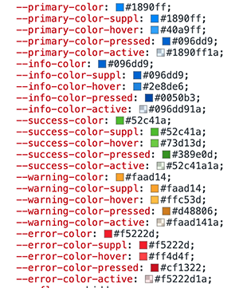

# 系统主题

系统主题实现基于 naiveUI 和 unocss。

## naiveUI 自定义主题

通过系统提供的 ConfigProvider 组件控制 UI 组件的主题样式

```vue
<template>
  <n-config-provider
    :theme="theme.naiveTheme"
    :theme-overrides="theme.naiveThemeOverrides"
    :locale="zhCN"
    :date-locale="dateZhCN"
    class="h-full"
  >
    <naive-provider>
      <router-view />
    </naive-provider>
  </n-config-provider>
</template>
```

::: tip 代码位置
./src/App.vue
:::

- 组件 ConfigProvider 的 theme 属性控制组件的暗黑模式, themeOverrides 属性可以传入规定好的各种颜色和其他样式配置，例如：主题颜色相关的 primary, info, success, warning, error 等

- naiveUI 会根据 themeOverrides 在 html 上生成各种 css 变量

  例如:
  

- 变更 themeOverrides 的值，来调整组件的主题颜色

## unocss 自定义主题

通过 unocss 扩展 theme，来接收由 naiveUI 生成的 css 变量， 不同的 theme 扩展分别对应到 naiveUI 的主题颜色

```ts
export default defineConfig({
  theme: {
    colors: {
      primary: 'var(--primary-color)',
      primary_hover: 'var(--primary-color-hover)',
      primary_pressed: 'var(--primary-color-pressed)',
      primary_active: 'var(--primary-color-active)',
      info: 'var(--info-color)',
      info_hover: 'var(--info-color-hover)',
      info_pressed: 'var(--info-color-pressed)',
      info_active: 'var(--info-color-active)',
      success: 'var(--success-color)',
      success_hover: 'var(--success-color-hover)',
      success_pressed: 'var(--success-color-pressed)',
      success_active: 'var(--success-color-active)',
      warning: 'var(--warning-color)',
      warning_hover: 'var(--warning-color-hover)',
      warning_pressed: 'var(--warning-color-pressed)',
      warning_active: 'var(--warning-color-active)',
      error: 'var(--error-color)',
      error_hover: 'var(--error-color-hover)',
      error_pressed: 'var(--error-color-pressed)',
      error_active: 'var(--error-color-active)',
    }
  }
});
```

::: tip 代码位置
./uno.config.ts
:::

借助 unocss 的能力，可以用类似 `text-primary bg-primary` 等 class 名称应用 naiveUI 组件的不同主题色

## unocss 的暗黑模式

```ts
export default defineConfig({
  presets: [presetUno({ dark: 'class' })],
});
```

::: tip 代码位置
./uno.config.ts
:::

通过 unocss 提供的预设暗黑模式方案, 只要在 html 上添加 class="dark"，则项目中类似于 `dark:text-#000 dark:bg-#333` 的 class 就会生效，从而达到暗黑模式的效果

## 系统主题配置抽屉
