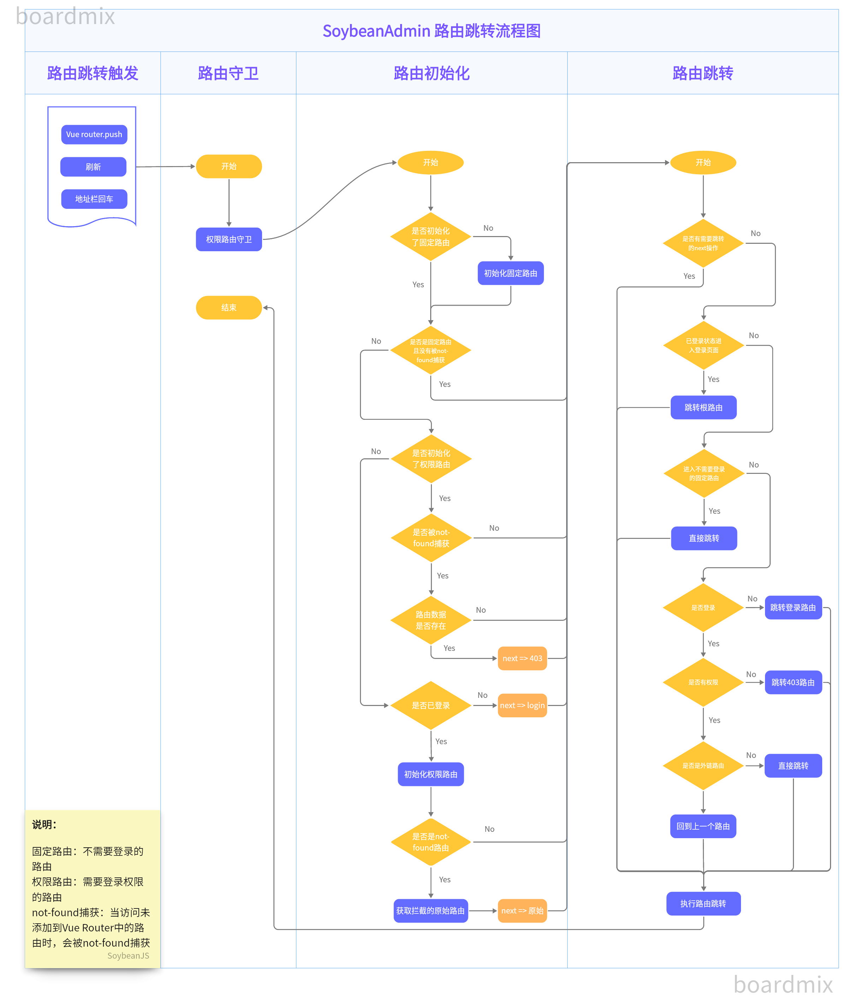

# 路由守卫

路由守卫是路由跳转过程中的统一拦截层，负责登录校验、动态路由初始化、权限校验、进度条以及页面标题等逻辑，确保用户在进入每个页面前都经过正确的鉴权与初始化流程。

## 整体结构

项目的路由守卫位于 `src/router/guard` 目录，入口为 `createRouterGuard`，它在创建路由实例后被调用，组合了三个相互独立的守卫：

::: tip 代码位置
src/router/guard/index.ts
:::

```ts
export function createRouterGuard(router: Router) {
  createProgressGuard(router); // 进度条守卫
  createRouteGuard(router); // 路由切换与权限守卫
  createDocumentTitleGuard(router); // 文档标题守卫
}
```

- **createProgressGuard**：在 `beforeEach` 中开启进度条，在 `afterEach` 中结束进度条。
- **createRouteGuard**：在 `beforeEach` 中处理登录校验、动态路由初始化与权限校验，是路由守卫的核心。
- **createDocumentTitleGuard**：在 `afterEach` 中根据路由的 `meta` 设置文档标题。

## 进度条守卫

`createProgressGuard` 借助挂载在 `window` 上的 `NProgress` 实现页面切换时的顶部进度条：进入时调用 `start`，完成后调用 `done`。

```ts
export function createProgressGuard(router: Router) {
  router.beforeEach(() => {
    window.NProgress?.start?.();
  });
  router.afterEach(() => {
    window.NProgress?.done?.();
  });
}
```

## 路由切换守卫

`createRouteGuard` 是路由守卫的核心逻辑，全部在 `beforeEach` 中完成。它先调用 `initRoute` 进行初始化与重定向判断，若返回了目标地址则直接跳转；否则继续进行登录与权限校验。

### initRoute：初始化与重定向

`initRoute` 负责常量路由与动态路由的初始化，并处理被 `not-found` 路由捕获的情况，主要分为以下几个阶段：

1. **常量路由未初始化**：调用 `initConstantRoute` 初始化常量路由，并重定向回原始路由（携带原有的 `query` 与 `hash`）。
2. **未登录**：若目标路由是常量路由（且非 `not-found`），允许直接访问；否则重定向到登录页，并通过 `getRouteQueryOfLoginRoute` 携带 `redirect` 查询参数。
3. **已登录但动态路由未初始化**：调用 `initAuthRoute` 初始化权限路由，若当前是被 `not-found` 捕获的路由，则在初始化完成后重定向回原始路由。
4. **动态路由已初始化**：若非 `not-found` 路由则放行；若是被 `not-found` 捕获，则进一步判断该路由是否存在，存在但无权访问时重定向到 `403`。

### 登录与权限校验

`initRoute` 返回 `null` 后，`beforeEach` 会继续进行登录状态与角色权限的校验：

- 已登录时访问 `login` 路由，自动跳转到根路由 `root`。
- 路由无需登录（`meta.constant`）时直接放行，交由 `handleRouteSwitch` 处理。
- 需要登录但未登录时，跳转到 `login` 并携带 `redirect: to.fullPath`。
- 已登录但无权访问时（既非超级管理员、`meta.roles` 也未命中），跳转到 `403`。
- 校验通过后，由 `handleRouteSwitch` 完成切换；其中若路由带有 `meta.href`，则以新窗口打开外链并停留在当前页面。

::: tip 代码位置
src/router/guard/route.ts
:::

## 文档标题守卫

`createDocumentTitleGuard` 在 `afterEach` 中根据路由 `meta` 设置浏览器标题：若存在 `i18nKey` 则使用 `$t` 进行国际化翻译，否则使用 `title` 字段。

```ts
export function createDocumentTitleGuard(router: Router) {
  router.afterEach(to => {
    const { i18nKey, title } = to.meta;
    const documentTitle = i18nKey ? $t(i18nKey) : title;
    useTitle(documentTitle);
  });
}
```

## 路由守卫流程图

下图完整展示了上述守卫的执行流程，可结合上文配合阅读：



[高清PDF](/router-guard-flow.pdf)
