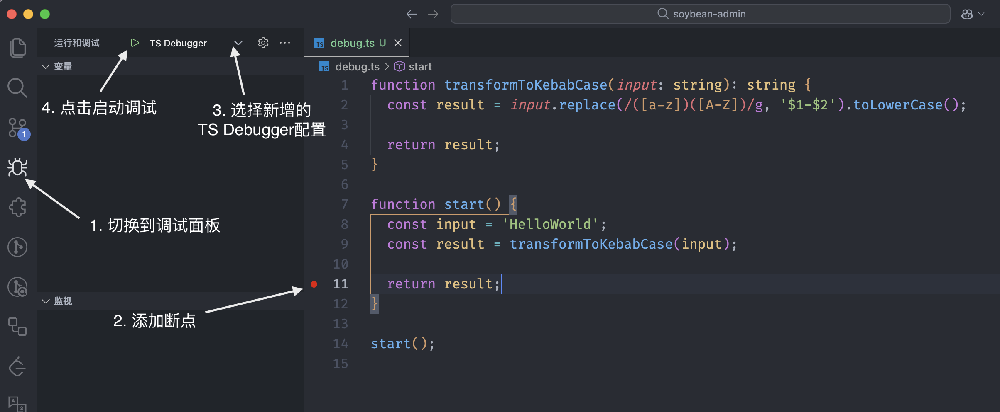
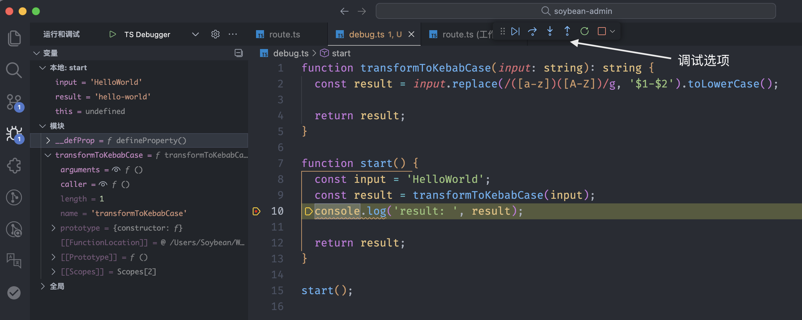
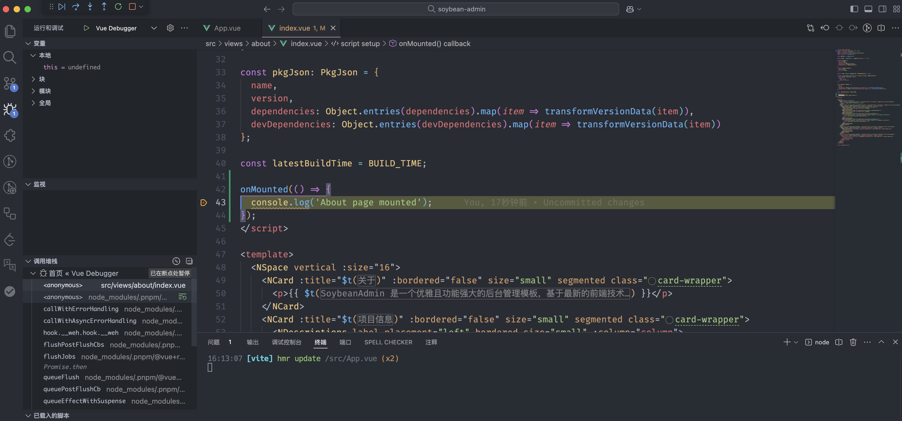

# 调试

## 概述

在软件开发的世界里，调试就像是开发者的放大镜和手术刀，它不仅能帮助我们：

- 🔍 快速定位并修复代码错误
- 🔄 深入理解代码执行流程
- 📊 实时监控变量状态
- 💾 分析内存使用情况
- ⚡ 优化程序性能

本文将带你探索如何使用 VSCode 强大的调试功能，让调试过程变得轻松高效。

## JavaScript 和 TypeScript 调试

### tsx - TypeScript 执行利器

[`tsx`](https://tsx.is/) 是Node.js对运行TypeScript的增强，它让 TypeScript 代码的执行变得简单直接：

- 零配置执行 TypeScript 文件
- 支持 ES 模块和 CommonJS
- 内置源码映射支持
- 优秀的性能表现

```bash
# 安装 tsx
npm install -g tsx

# 执行 TypeScript 文件
tsx your-file.ts
```

通过 VSCode 的调试配置，我们可以轻松实现断点调试、变量监控等高级功能。下一节，我们将详细介绍如何配置 VSCode 的调试环境。

> 💡 提示：VSCode 的调试功能与 Node.js 的调试器完美集成，让你可以像调试 JavaScript 一样轻松调试 TypeScript 代码。

### tsx 调试步骤

1. 首先全局安装依赖 `tsx`

```bash
npm i -g tsx
```

2. 添加以下调试配置到项目中 `.vscode/launch.json` 中

```json
{
  "version": "0.2.0",
  "configurations": [
    {
      "type": "node",
      "request": "launch",
      "name": "TS Debugger",
      "runtimeExecutable": "tsx",
      "skipFiles": ["<node_internals>/**", "${workspaceFolder}/node_modules/**"],
      "program": "${file}"
    }
  ]
}
```

3. 调试测试
   - 新增文件 `debug.ts`
   - 输入以下代码

     ```ts
     function transformToKebabCase(input: string): string {
       return input.replace(/([a-z])([A-Z])/g, '$1-$2').toLowerCase();
     }

     function start() {
       const input = 'HelloWorld';
       const result = transformToKebabCase(input);
       return result;
     }

     start();
     ```

4. 按照图片中的步骤进行调试

   
   

## Vue 调试

### 调试步骤

1. 添加以下调试配置到项目中 `.vscode/launch.json` 中

```json
{
  "version": "0.2.0",
  "configurations": [
    {
      "type": "chrome",
      "request": "launch",
      "name": "Vue Debugger",
      "url": "http://localhost:9527",
      "webRoot": "${workspaceFolder}"
    }
  ]
}
```

> 配置中的url里的端口号和项目本地开发运行时的端口号保持一致

2. 本地启动项目
3. 测试调试

- 打开页面文件`about/index.vue`, 在`onMounted`中添加断点
- 选择`Vue Debugger`, 点击启动调试 - 浏览器进入about页面，然后会自动跳转回VSCode
  
  > 同理，例如当测试点击按钮后执行的逻辑，在点击事件中添加相应断点，然后在页面上点击即可触发调试

### 断点类型

- 在组件methods中设置断点
- 在生命周期钩子中设置断点
- 在计算属性中设置断点
- 在watch中设置断点
- 在路由守卫中设置断点

> 记得在开发环境启用source map以获得最佳调试体验:

```ts
// vite.config.ts
export default defineConfig({
  build: {
    sourcemap: true
  }
```
